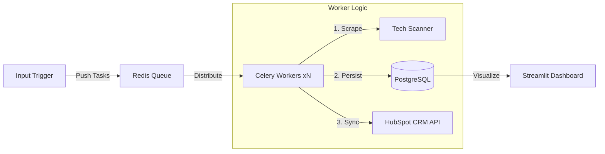
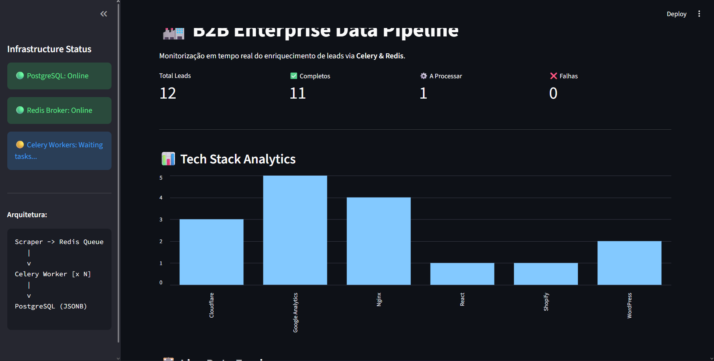

# 🏭 B2B Lead Enrichment Pipeline (Enterprise Architecture)


> **From Domain to Data.** A distributed, asynchronous system that transforms raw domain lists into enriched company profiles with tech stack analysis, integrated directly into HubSpot CRM.

## 📖 Project Overview

Businesses often possess lists of potential leads (domains) but lack the actionable data needed for sales outreach. Manual research is slow and unscalable.

This project solves that problem by implementing a **Distributed ETL Pipeline**. It accepts a high volume of domains, processes them asynchronously using worker nodes to identify the technology stack (e.g., "Do they use Shopify? React? AWS?"), and syncs the enriched data to a CRM.

## 🏗️ Architecture

The system uses a **Microservices-ready** architecture orchestrated via Docker Compose:



## ✨ Key Features

* **⚡ Asynchronous Processing:** Uses Celery & Redis to handle thousands of domains concurrently without blocking.
* **🕵️ Custom Tech Fingerprinting:** Proprietary scanner logic analyzes HTML, Meta Tags, and HTTP Headers to detect technologies (WordPress, Shopify, React, Stripe, etc.).
* **💾 Robust Persistence:** Data is stored in PostgreSQL using SQLAlchemy ORM, with JSONB support for flexible data schemas.
* **🔗 CRM Integration:** Automatically creates or updates Company records in HubSpot via API.
* **📊 Live Dashboard:** A Streamlit interface to monitor pipeline health, success rates, and tech stack analytics in real-time.

## 🛠️ Tech Stack

* **Orchestration:** Docker & Docker Compose
* **Language:** Python 3.x
* **Task Queue:** Celery
* **Broker:** Redis (Alpine Image)
* **Database:** PostgreSQL 15 (Alpine Image)
* **Web Scraping:** requests, beautifulsoup4
* **Visualization:** streamlit, pandas

## 🚀 Installation & Usage

### 1. Clone the repository

```bash
git clone [https://github.com/RodrigoMendes04/Personal-Projects.git](https://github.com/RodrigoMendes04/Personal-Projects.git)
cd "Personal-Projects/B2B Pipeline"
```

### 2. Set up the environment

It is recommended to use a virtual environment.

```bash
python -m venv venv
source venv/bin/activate  # On Windows: venv\Scripts\activate
pip install -r requirements.txt
```

### 3. Configure Credentials

Create a `.env` file in the root directory and add your HubSpot Token:

```plaintext
HUBSPOT_TOKEN=pat-na1-YOUR_HUBSPOT_TOKEN_HERE
```

### 4. Launch Infrastructure (Docker)

Start the Database and Redis containers:

```bash
docker-compose up -d
```

### 5. Run the Workers

Open a terminal to start the processing units:

```bash
# On Windows (Required pool=solo)
celery -A tasks worker --loglevel=info --pool=solo

# On Linux/Mac
celery -A tasks worker --loglevel=info
```

### 6. Trigger the Pipeline

Open a second terminal and feed domains into the system:

```bash
python trigger.py
```

### 7. Launch the Dashboard

To view real-time analytics:

```bash
streamlit run dashboard.py
```

## 📸 Screenshots

**Streamlit Dashboard:**


## 📄 License

Distributed under the MIT License. See `LICENSE` for more information.

---
*Built for High-Performance Data Engineering.*
