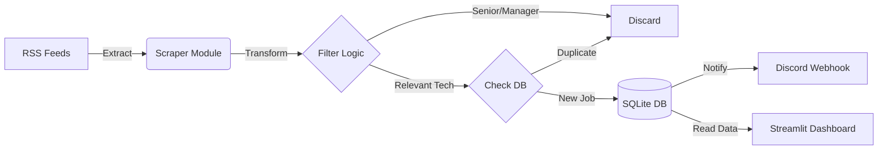

# 🤖 Automated Job Hunter Pipeline


> **Stop scrolling, start automating.** A smart data pipeline that scrapes, filters, and delivers relevant job opportunities directly to Discord in real-time, coupled with an analytics dashboard for market insights.

## 📖 Overview

Searching for a job manually is inefficient. This project automates the process by monitoring multiple high-quality job boards (WeWorkRemotely, RemoteOK) via RSS feeds. It applies intelligent text filtering to separate "Junior/Mid-level" roles from "Senior/Manager" roles and delivers a rich notification card to a Discord channel.

It features a built-in **SQL deduplication layer** and a **Streamlit Dashboard** to visualize trends in the job market.

## 🏗️ Architecture

The system follows a modular "Extraction-Transformation-Load" (ETL) pattern:



## ✨ Key Features

* **Multi-Source Ingestion:** Aggregates data from multiple job boards simultaneously.
* **Smart Filtering:**
    * ✅ **Whitelist:** Accepts jobs with keywords like *Python, Data, SQL, Automation*.
    * ⛔ **Blacklist:** Automatically rejects titles with *Senior, Staff, Principal, Director*.
* **Deduplication:** Uses SQLite to track processed URLs, preventing spam.
* **Analytics Dashboard:** A web interface to view metrics and tech stack trends.
* **Rich Notifications:** Sends color-coded Discord Embeds (Green for Entry-level, Blue for others).

## 🛠️ Tech Stack

* **Language:** Python 3.x
* **Data Parsing:** `feedparser` (XML/RSS)
* **Database:** `sqlite3` (Native)
* **Visualization:** `streamlit`, `pandas`
* **API Integration:** `requests` (Discord Webhooks)
* **Security:** `python-dotenv` (Environment variables)

## 🚀 Installation & Usage

### 1. Clone the repository
```bash
git clone [https://github.com/RodrigoMendes04/Personal-Projects.git](https://github.com/RodrigoMendes04/Personal-Projects.git)
cd "Personal-Projects/Job Hunter"
```

### 2. Set up the environment
It is recommended to use a virtual environment.
```bash
python -m venv venv
source venv/bin/activate  # On Windows: venv\Scripts\activate
pip install -r requirements.txt
```

### 3. Configure Credentials
Create a `.env` file in the root directory and add your Discord Webhook URL:
```text
DISCORD_WEBHOOK=[https://discord.com/api/webhooks/YOUR_WEBHOOK_URL_HERE](https://discord.com/api/webhooks/YOUR_WEBHOOK_URL_HERE)
```

### 4. Run the Pipeline (Scraper)
To fetch jobs and send alerts:
```bash
python main.py
```

### 5. Launch the Dashboard (Analytics)
To view the data visualization:
```bash
streamlit run dashboard.py
```

## ⚙️ Configuration (`main.py`)

You can customize the search logic by editing the lists in `main.py`:

* `TARGET_URLS`: Add or remove RSS feed URLs.
* `TECH_KEYWORDS`: Keywords required to accept a job (e.g., "python", "react").
* `EXCLUDED_KEYWORDS`: Keywords that trigger immediate rejection (e.g., "senior").

## 📸 Screenshots

**Terminal Output:**
```text
[Scraper] Reading RSS Feed: remote-python-jobs.rss...
[Scraper] Success! 12 jobs extracted.
[DB] New job saved: Junior Python Developer at TechCorp
[Discord] Alert sent successfully.
```

**Discord Notification:**


**Streamlit Dashboard:**


## 📄 License

Distributed under the MIT License. See `LICENSE` for more information.

---
*Built with ☕ and Python.*
